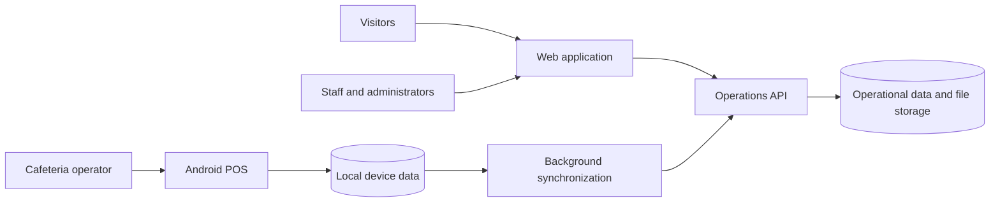

# Pimienta Alimentos

Software suite for **Pimienta Alimentos**, a food-services company in Mexico. Created and maintained by Alexis Trejo, this monorepo combines the public company site, a private operations workspace, the central API, and an Android point of sale for school cafeterias.

## Platforms

| Platform | Purpose | Status | Production link |
|---|---|---|---|
| [Web](web/) | Public company site, legal pages, staff workspace, and central POS administration | Production | [pimienta-alimentos.com](https://pimienta-alimentos.com) |
| [Backend](backend/) | Operations API for staff, HR, CRM, inventory, payroll, files, notifications, and POS synchronization | Production | [api.pimienta-alimentos.com](https://api.pimienta-alimentos.com) |
| [Android POS](mobile/pos/) | Local-first point of sale for school cafeterias | Development | Signed APK published through CI |

`pre/` is excluded from the product suite and its documentation. It contains preparatory material, not a deployed platform.

## How It Works



The web application provides public information and the internal workspace. It calls the API for shared operational records and authorization. The POS records cafeteria activity locally first, then synchronizes approved data and event batches with the API when connectivity is available. The API is the source of truth for central operations and controls access to company locations.

## Technologies

| Area | Technologies |
|---|---|
| Web | Angular, TypeScript, SSR, Express, Tailwind CSS, Docker |
| API | Java, Spring Boot, PostgreSQL, Flyway, Redis, S3, JWT, Docker |
| Android POS | Kotlin, Jetpack Compose, Room, WorkManager, Retrofit |
| Delivery | GitHub Actions, GitHub Container Registry, Docker Compose, Cloudflare Access, S3 |

## Delivery

Changes to `web/` and `backend/` are built and tested by GitHub Actions. Successful changes to `main` publish Docker images to GHCR, then deploy the matching service on the remote server through SSH protected by Cloudflare Access.

The Android POS workflow runs unit tests, builds a signed release APK, and publishes the APK plus its version manifest to S3. It is not deployed as a Docker service.

## Documentation

The project reference documents are in [`docs/project/`](docs/project/):

| Document | Description |
|---|---|
| [Suite product](docs/project/pimienta-alimentos/product.md) | Company-level purpose, users, scope, and platform map |
| [Project registry](docs/project/projects.ts) | Typed project metadata, status, metrics, and documentation flags |
| [Web docs](docs/project/pimienta-web/) | Product, architecture, features, and deployment flow for the web app |
| [Backend docs](docs/project/pimienta-backend/) | Product, architecture, features, infrastructure, and API contract |
| [POS docs](docs/project/pimienta-pos/) | Product, local-first architecture, features, and APK delivery flow |
| [Observability architecture](docs/project/pimienta-alimentos/observability.md) | Target logs, metrics, dashboards, alerting, and client telemetry design |
| [Observability plan](docs/project/pimienta-alimentos/observability-plan.md) | Phased implementation checklist for the observability target |
| [POS business docs](mobile/pos/docs/) | Detailed Spanish product, UX, workflow, integration, and technical documentation |

The live backend contract is available through [Swagger UI](https://api.pimienta-alimentos.com/swagger-ui) and [OpenAPI JSON](https://api.pimienta-alimentos.com/v3/api-docs).

## Local Entry Points

```sh
# Web
cd web && npm ci && npm start

# API
cd backend && cp .env.example .env && docker compose up --build

# Android POS
cd mobile/pos && ./gradlew :app:assembleDebug
```

Refer to each platform document for environment requirements and its full local workflow.
