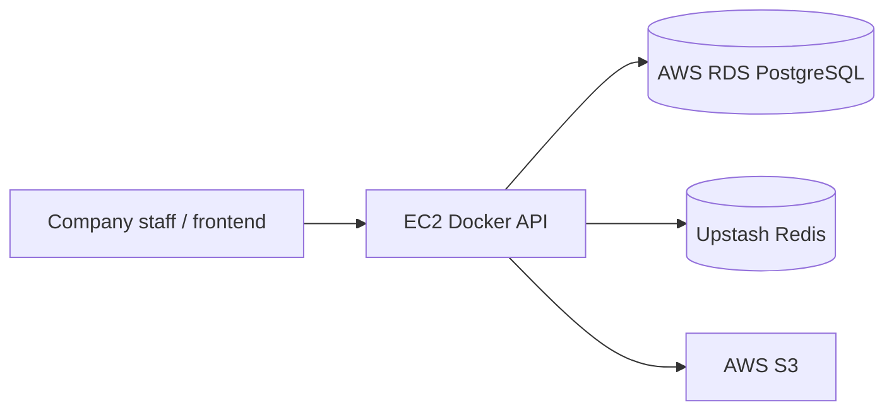

# Pimienta Alimentos Backend

**Production Spring Boot API for company operations — used daily by Pimienta Alimentos employees and staff.**

[](https://openjdk.org/)
[](https://spring.io/projects/spring-boot)

> **Real-world system:** This is not a demo or tutorial project. The API is **deployed in the cloud** and actively supports HR, inventory, payroll, CRM, contracts, tasks, and file management for the company workforce.

---

## Table of contents

- [About](#about)
- [Features](#features)
- [Documentation](#documentation)
- [Tech stack](#tech-stack)
- [Architecture at a glance](#architecture-at-a-glance)
- [Prerequisites](#prerequisites)
- [Quick start](#quick-start)
- [Configuration](#configuration)
- [API overview](#api-overview)
- [Project structure](#project-structure)
- [Deployment](#deployment)
- [Testing](#testing)
- [Contributing](#contributing)
- [Security & compliance](#security--compliance)
- [License](#license)

---

## About

Pimienta Alimentos Backend is the central API for **Pimienta Alimentos**, a food company whose employees and administrative staff rely on it every day. It unifies employee management, attendance, contracts, inventory, payroll, CRM, tasks, headquarters, notifications, and file storage behind a single hexagonal Spring Boot service.

The system runs in **production on AWS**: API on **EC2** (Docker), **RDS PostgreSQL 16**, **Upstash Redis** (TLS), and **S3** for assets.

| | |
|---|---|
| **Version** | 1.0.0 |
| **Status** | Production — in active use by company staff |
| **Primary API prefix** | `/api/v1` |
| **Live / health check** | [https://{{PRODUCTION_HOST}}/api/v2/health](https://{{PRODUCTION_HOST}}/api/v2/health) |
| **OpenAPI (Swagger)** | [https://{{PRODUCTION_HOST}}/swagger-ui](https://{{PRODUCTION_HOST}}/swagger-ui) |

Replace `{{PRODUCTION_HOST}}` with your deployed EC2 hostname or load balancer DNS.

---

## Features

- JWT authentication with admin-approved registration and Redis-backed refresh tokens
- Employee HR: profiles, attendance, work schedules, S3 photos, XLSX import/export
- Inventory workflows: purchases, sales, transfers, approvals, low-stock alerts
- Payroll, CRM (opportunities & projects), contracts, tasks, and headquarters
- Redis token-bucket rate limiting and role-based access (ADMIN / MANAGER)
- OpenAPI 3 + Swagger UI; 14 MockMvc integration test suites
- POS integration is specified, not implemented yet — see [docs/v2/post_integration](docs/v2/post_integration/README.md)

---

## Documentation

Handwritten docs live under [`docs/`](docs/README.md). Live HTTP contract is **Swagger UI** at `/swagger-ui`.

| Document | What you will find |
|----------|-------------------|
| [docs/v2/post_integration](docs/v2/post_integration/README.md) | POS ↔ API specs: audit, open decisions, Device/Admin API, module plan |
| [docs/test](docs/test/) | Follow-ups from MockMvc integration tests |
| [docs/extra](docs/extra/) | Extra notes from employee/attendance test passes |

---

## Tech stack

- **Java 26** · **Spring Boot 4.0.5** · Spring Security · Spring Data JPA
- **PostgreSQL 16** (AWS RDS) · **Flyway** migrations · Hibernate `validate`
- **Redis 7** (Upstash, `rediss://`) — refresh tokens, rate limiting
- **JWT** (jjwt) · **springdoc-openapi 3** · **Apache POI** (XLSX)
- **AWS S3** · **Docker** / Docker Compose · **Maven**

---

## Architecture at a glance

Hexagonal (ports & adapters) monolith: ten bounded contexts under `module/*`, each with `core` (domain, application, ports) and adapters (REST, JPA, S3, Redis). Shared kernel in `shared/` (`BaseDomain`, pagination, rate limits).


```mermaid
flowchart LR
  Staff[Company staff / frontend] --> EC2[EC2 Docker API]
  EC2 --> RDS[(AWS RDS PostgreSQL)]
  EC2 --> Redis[(Upstash Redis)]
  EC2 --> S3[AWS S3]
```

POS bounded-context design (draft): [docs/v2/post_integration](docs/v2/post_integration/README.md).

---

## Prerequisites

- **Java 26** and **Maven** (or `./mvnw`)
- **Docker & Docker Compose** (recommended for local dev)
- **PostgreSQL** and **Redis** (local via Compose, or cloud RDS + Upstash)
- Copy `backend/.env.example` → `backend/.env` for secrets and connection strings

---

## Quick start

### Local development (Docker — recommended)

```bash
cd backend
cp .env.example .env
docker network create pimienta-net   # once
docker compose up --build
```

- Health: http://localhost:8080/api/v2/health
- Swagger: http://localhost:8080/swagger-ui
- Postgres (host): `localhost:5431` · Redis (host): `localhost:6378` · LocalStack S3: `localhost:4566`

Spring profile is `dev` (Hibernate `update`, Flyway off, LocalStack, extra actuator). Source is bind-mounted; DevTools restarts after Java recompile.

### Local development (Maven on host)

Bring up dependencies, then run the API on the host (`SPRING_PROFILES_ACTIVE=dev` in `.env`):

```bash
cd backend
cp .env.example .env
docker network create pimienta-net   # once
docker compose up -d postgres redis localstack
./mvnw spring-boot:run
```

Dotenv loads `.env` automatically via `DotenvEnvironmentPostProcessor`. Host URLs use the published ports (`localhost:5431`, `redis://localhost:6378`, LocalStack `http://localhost:4566`).

### Cloud / production (EC2)

Production uses the fat-JAR `Dockerfile` (not this Compose file) with Spring profile `prod`, RDS, Upstash Redis, and real S3. GHCR publish/deploy is handled by CI/CD.

---

## Configuration

Copy `.env.example` to `.env`. Minimum variables for production:

| Variable | Description |
|----------|-------------|
| `POSTGRES_URL` / `POSTGRES_USER` / `POSTGRES_PASSWORD` | AWS RDS PostgreSQL JDBC URL |
| `REDIS_URL` | Upstash Redis (`rediss://...`) or local `redis://` |
| `PIMIENTA_REDIS_KEY_PREFIX` | Key namespace on shared Redis |
| `PIMIENTA_SECURITY_JWT_SECRET` | HS256 secret (256+ bits in production) |
| `AWS_REGION` / `AWS_S3_BUCKET_NAME` | S3 for employee photos and file assets |
| `AWS_ACCESS_KEY_ID` / `AWS_SECRET_ACCESS_KEY` | Or IAM role on EC2 |
| `API_PORT` | Host port mapped to container 8080 |

Full list: [.env.example](.env.example).

---

## API overview

| Area | Base path |
|------|-----------|
| Auth | `/api/v1/auth/` |
| Users | `/api/v1/users/` |
| Employees | `/api/v1/employees/` |
| Contracts | `/api/v1/contracts/` |
| CRM | `/api/v1/opportunities/`, `/api/v1/projects/` |
| Tasks | `/api/v1/tasks/` |
| Headquarters | `/api/v1/headquarters/` |
| Inventory | `/api/v1/inventory/` |
| Payroll | `/api/v1/payroll/` |
| Files | `/api/v1/files/` |
| Notifications | `/api/v1/notifications/` |
| Health | `/api/v2/health/` |
| POS (draft spec only) | `/api/v1/pos/` — [post_integration](docs/v2/post_integration/05-device-api.md) |

Authentication: `Authorization: Bearer <access_token>` (JWT). Interactive reference: **Swagger UI** at `/swagger-ui`.

---

## Project structure

```
backend/
├── docker/                    # LocalStack init + Compose helper scripts
├── docs/
│   ├── v2/post_integration/   # POS ↔ API specs (handwritten)
│   ├── test/                  # Integration test follow-up notes
│   └── extra/                 # Extra IT notes
├── src/
│   ├── main/java/.../pimienta/
│   │   ├── config/            # Security, Redis, OpenAPI, rate limit, AWS
│   │   ├── module/            # account, employees, contract, crm, task, …
│   │   └── shared/            # BaseDomain, pagination, spreadsheet, web
│   └── main/resources/        # application*.yaml, db/migration/
├── pom.xml
└── mvnw
```

---

## Deployment

**Production:** Spring Boot JAR in Docker on **AWS EC2**, connecting to **AWS RDS PostgreSQL** and **Upstash Redis** (TLS). File uploads go to **AWS S3**. Profile `prod` via `SPRING_PROFILES_ACTIVE`.

---

## Testing

```bash
./mvnw test
```

Integration tests use H2 in-memory; rate limiting is disabled in the test profile. See `src/test/java/.../integration/`.

---

## Contributing

1. Fork the repository
2. Create a feature branch (`git checkout -b feature/my-change`)
3. Commit with clear messages
4. Open a pull request

Internal changes should respect hexagonal module layout and existing OpenAPI `Doc*` annotation patterns.

---

## Security & compliance

This API handles **real company and employee data** in production. Do not commit `.env`, JWT secrets, or AWS credentials. Registration requires administrator approval before staff can access the system.

Report vulnerabilities privately to alexistrejo11@gmail.com.

---

## License

Apache License 2.0 — see [LICENSE](LICENSE) file.

---

## Links

| Resource | URL |
|----------|-----|
| Repository | [https://github.com/alexistrejo11/pimienta](https://github.com/alexistrejo11/pimienta) |
| Documentation hub | [docs/README.md](docs/README.md) |
| Health (production) | [https://{{PRODUCTION_HOST}}/api/v2/health](https://{{PRODUCTION_HOST}}/api/v2/health) |
