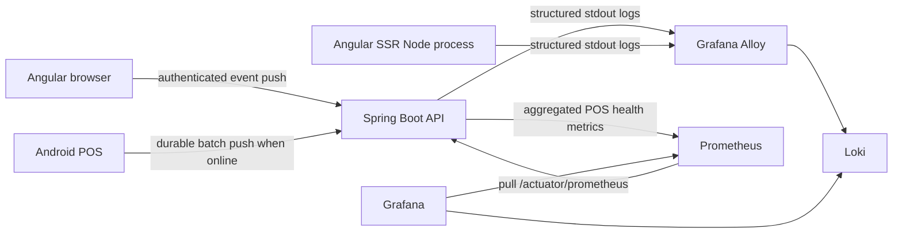

## Purpose

Pimienta Alimentos operates three runtimes with different network properties: a central Spring Boot API, an Angular application that executes in user browsers, and offline-first Android POS devices. This document defines the completed-state observability architecture for logs, metrics, correlation, dashboards, and alerts.

Observability is operational evidence, not the business audit trail. It must help diagnose availability, errors, latency, synchronization, and device health without exposing credentials, payment data, personal data, or unbounded identifiers.

## Architecture

Prometheus pulls only targets controlled by Pimienta infrastructure. The API exposes Micrometer metrics at `/actuator/prometheus`; the endpoint is reachable only from the observability network or the trusted reverse proxy, never publicly from the Internet.

Browsers and POS tablets are clients, not scrape targets. They push telemetry to the API. The API validates and normalizes each event, then emits it as structured server log output. Grafana Alloy collects that output and writes it to Loki. Loki is not exposed to browsers or POS devices.

The Angular SSR process is a server process and emits its own runtime logs to Alloy. Browser errors remain client telemetry and use the API ingestion path.

The ingestion contract is deliberately small and versioned with the API:

- `POST /api/v1/telemetry/web/events`: one validated browser event, authenticated with a staff JWT.
- `POST /api/v1/pos/telemetry/events`: up to 50 POS events plus an optional health snapshot, authenticated with a device JWT using the POS sync scope.

Telemetry routes are operational transport, not business mutations, so they are excluded from the business audit stream while still producing their own ingestion metrics and client log records.

## Local and Production Topology

The repository contains `observability/` as a local-development Docker Compose stack with Prometheus, Loki, Grafana, Alloy, provisioning, and example dashboards. It creates or joins the shared `pimienta-net` Docker network used by the local backend and web services.

Production runs a separate observability instance with its own persistent volumes, TLS, access control, credentials, retention policy, and backups. Local configuration is versioned as a reproducible development environment; production values and secrets are supplied by deployment infrastructure and are never committed.

## Logs

### Server Logs

Spring Boot and the Angular SSR Node process write JSON logs to stdout. Alloy parses the JSON and attaches only stable infrastructure labels:

- `service`: `backend` or `web-ssr` (from the Compose service, not from JSON fields)
- `environment`: deployment environment (`local` on the development stack)
- `level`: log severity
- `source`: `application`, `audit`, `web-client`, or `pos-client`

The backend preserves `traceId` in its mapped diagnostic context and returns it as `X-Trace-Id`. Request failures, user-facing API failures, and client telemetry include this identifier where available so a browser or POS report can be related to API logs.

The audit stream contains only completed mutations and sensitive security actions: `POST`, `PUT`, `PATCH`, `DELETE`, authentication events, device enrollment, credential refresh, and administrative state changes. Read requests are not audit events. Audit events are structured fields, not JSON embedded inside a string message.

### Browser Events

Angular captures uncaught errors, unhandled promise rejections, network failures, HTTP 5xx responses, and failures of write operations. Successful reads and routine successful responses are not sent as telemetry. Development console logging remains useful locally, but it is not the central log transport.

The web event endpoint applies request-size limits, rate limits, payload schema validation, redaction, and an explicit interceptor opt-out to prevent telemetry requests from reporting themselves. Authenticated workspace events derive actor identity on the server from the JWT. Any anonymous public-site event path is separately rate-limited and contains no user-provided identity.

### POS Events

The POS stores telemetry locally in Room before it is sent. The `SyncWorker` sends bounded batches only when connected, without delaying a sale or its operational outbox. It uses the existing device credential and retries transient transport failures. The API derives device and site identity from that credential instead of trusting fields submitted by the tablet.

POS logs cover unexpected errors, retrying or blocked synchronization, enrollment state changes, prolonged pending outbox, application version, and hardware integration failures once printer support exists. The local telemetry queue has a maximum size and retention rule; when full, it discards lowest-value oldest events before errors.

## Metrics

Prometheus collects standard Spring Boot, JVM, HTTP server, database-pool, and process metrics from Actuator. The API also exposes bounded custom metrics for POS and telemetry ingestion, including:

- received telemetry batches and rejected payloads (`pimienta_telemetry_events_received_total`, `pimienta_telemetry_events_rejected_total`);
- POS devices by synchronization health state (`pimienta_pos_devices{state}`);
- aggregate pending POS outbox count and oldest pending age (`pimienta_pos_pending_events`, `pimienta_pos_oldest_pending_age_seconds`);
- POS health snapshot receipts (`pimienta_telemetry_health_received_total`);

Client reports are state snapshots or counters received by the API. The API retains the latest valid device health state and exports aggregate metrics. Prometheus labels must remain low-cardinality: application, environment, route template, HTTP method/status, and a small fixed outcome or state set are allowed. Device ID, user ID, request ID, sale ID, URL query string, exception message, and stack trace are never metric labels.

## Data Protection and Reliability

- Never log authorization headers, access or refresh tokens, passwords, PINs, payment values, employee identifiers, full request/response bodies, or raw query strings.
- Redact sensitive web payload fields before console output or ingestion.
- Cap telemetry request size, event batch size, queue length, and message/stack-trace length.
- Rate-limit client telemetry independently from business endpoints and report rejected events as aggregate metrics only.
- Treat telemetry as best effort. A failure to send or ingest telemetry must not change business operation results, POS sales, authentication, or synchronization semantics.
- Use UTC timestamps and record both event time and API receipt time for offline POS events.

## Dashboards and Alerts

Grafana provides a shared operational view with at least these dashboards:

- API availability, request rate, latency, 4xx/5xx rate, JVM, database, and Redis health.
- Backend and SSR errors correlated by `traceId`.
- Browser error rate and failed write operations by release and route template.
- POS fleet health: devices not recently synchronized, pending queue age, blocked/re-enrollment devices, sync errors, and supported app versions.

Initial alerts notify operators when the API scrape target is unavailable, API 5xx rate exceeds its threshold, a POS device remains unsynchronized beyond its operating window, pending POS events age beyond their service objective, or telemetry ingestion rejects an abnormal volume of payloads.

## Future Tracing

The initial architecture uses `X-Trace-Id` for log correlation. Distributed tracing is a later concern: OpenTelemetry can replace or bridge this identifier when there is a concrete need to trace work across the browser, API, database, and external services. Adding OpenTelemetry is not required for the logs-and-metrics baseline.
