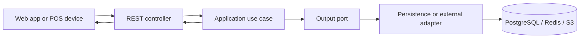
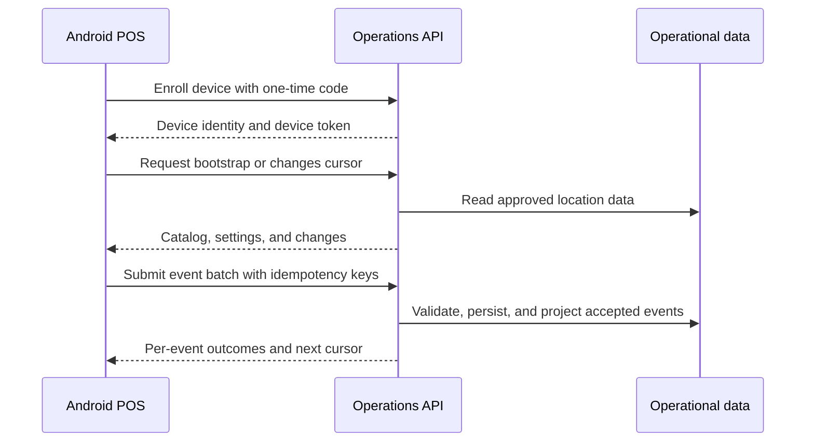

## Overview

The API is a modular Spring Boot monolith with ports-and-adapters structure. Its bounded contexts are account, contract, CRM, employees, files, headquarters, inventory, notifications, payroll, POS, and tasks.

Each context keeps domain state separate from application workflows. HTTP controllers validate and translate requests into commands or queries; application use cases coordinate the workflow through input and output ports; persistence and external integrations are adapters.

## Request Flow

Security runs before protected controllers. Staff requests carry a staff JWT; POS synchronization uses a device JWT after enrollment. The API enforces role and headquarters access before returning or changing operational records.

## POS Synchronization Flow

Only `SALE_CONFIRMED` has a complete server-side business projection today. Other event types may be preserved for audit or require review; this distinction is kept explicit rather than claiming that every POS event updates every operational projection.

## Data and Integration Boundaries

PostgreSQL stores operational data and Flyway migrations evolve its schema. Redis supports refresh-token storage and rate limiting. S3 stores file assets. The backend exposes the API contract used by the web app and Android POS; it does not render their user interfaces.
