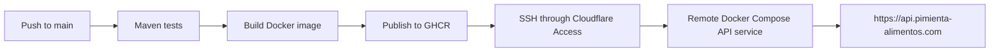

## Runtime Components

The production API runs in a Docker container with the production Spring profile. PostgreSQL is the primary data store; Redis supports refresh tokens and rate limiting; S3 stores assets. Flyway applies schema migrations and Hibernate validates the production schema.

Actuator exposes health, information, and Prometheus metrics in the production configuration. Secrets and service connection values are supplied as environment variables, not committed to the repository.

## Delivery Flow



Pull requests and changes to `main` under `backend/` run Maven tests. After a successful push to `main`, GitHub Actions publishes both `latest` and commit-tagged images to GHCR. The deploy job connects through Cloudflare Access, pulls the image, recreates only the API service, and removes only unused images for that service.

## Local Environment

Local Docker Compose provides PostgreSQL 16, Redis 7, and LocalStack for S3-compatible storage alongside the API. The development profile is intended for this environment; production uses external service credentials.

```sh
cd backend
cp .env.example .env
docker network create pimienta-net
docker compose up --build
```
