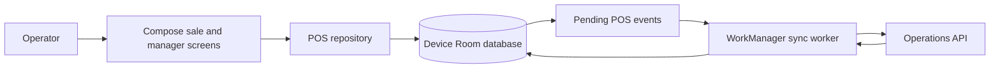
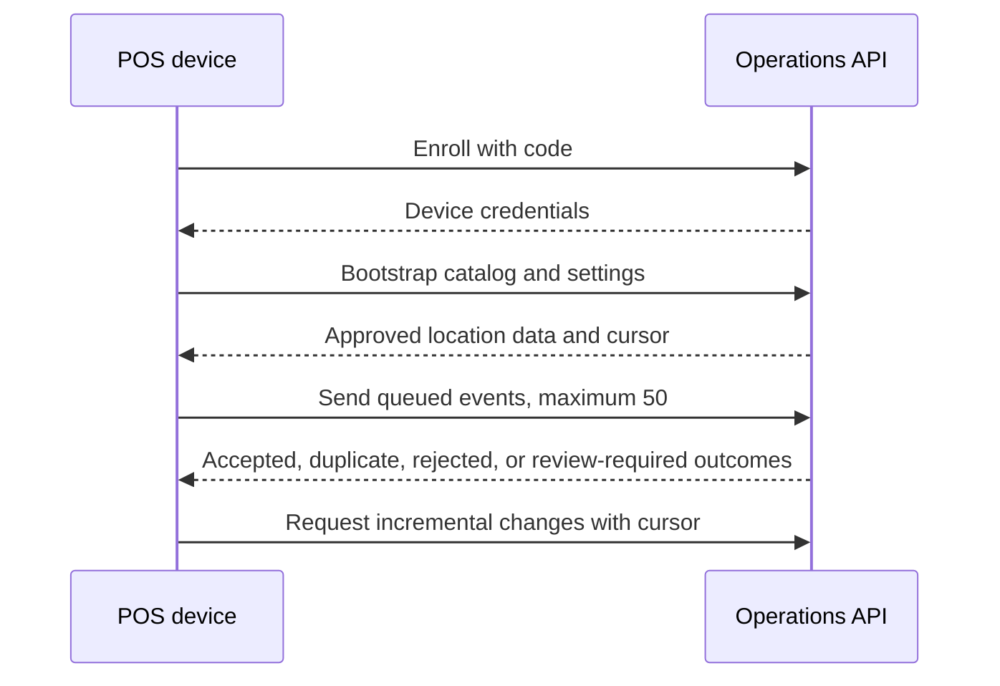

## Overview

Pimienta POS is a native Android application with a local-first design. Compose renders the operational interface, Room stores the device state and outbox, and WorkManager schedules network-constrained synchronization through the backend API.

## Operational Flow

The local database is the immediate operational source for a device. Sandbox and production data are isolated. Production synchronization runs only when network conditions are available; the app does not make a completed local sale depend on a live connection.

## Enrollment and Synchronization

The worker refreshes credentials after `401`, requires re-enrollment after a refresh failure or `403`, and reboots its local view from a bootstrap after a `409` cursor response. It marks accepted, duplicate, and review-required events as terminal; rejected events remain blocked for operator follow-up.

## Boundaries

The POS owns local sale interaction, device state, and its outbox. The backend owns device authorization, central catalog and configuration, event acceptance, and company-wide records. The web workspace is the central administration surface for the data that the device consumes.
