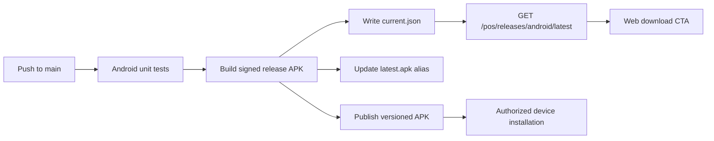

## Build and Runtime

The POS is a single native Android application module. It targets Android API 37, supports devices from API 26, and uses a production HTTPS endpoint. Debug builds additionally permit the Android emulator host and localhost for local development.

## Delivery Flow



Pull requests and changes to `main` under `mobile/pos/` run JVM unit tests. A successful push to `main` decodes the release keystore from GitHub secrets, builds a signed APK, and publishes:

| S3 key | Role |
|--------|------|
| `pimienta/releases/pos/android/{versionCode}/pimienta-pos-{versionName}.apk` | Immutable release binary |
| `pimienta/releases/pos/android/latest.apk` | Overwritten alias for ops convenience |
| `pimienta/releases/pos/android/current.json` | Pointer (`s3Key` = versioned object) + `versionName`, `versionCode`, `uploadedAt` |

`versionName` / `versionCode` live in `mobile/pos/app/build.gradle.kts`. Bump `versionCode` before merge; CI fails if that versioned key already exists. The backend does not hardcode the APK version — it serves whatever `current.json` says via `GET /api/v1/pos/releases/android/latest`.

## Local Development

```sh
cd mobile/pos
./gradlew :app:assembleDebug
./gradlew :app:test
```

Release signing is enabled only when `POS_STORE_FILE`, `POS_STORE_PASSWORD`, `POS_KEY_ALIAS`, and `POS_KEY_PASSWORD` are supplied. The app requires Internet and network-state permissions for production synchronization.
