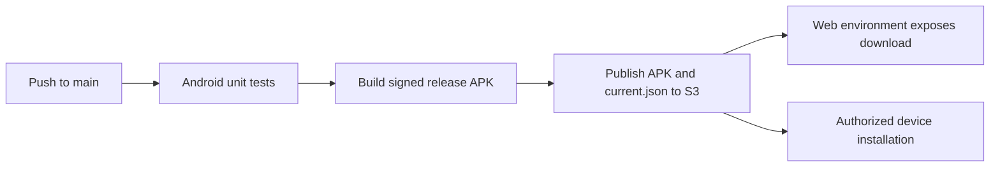

## Build and Runtime

The POS is a single native Android application module. It targets Android API 37, supports devices from API 26, and uses a production HTTPS endpoint. Debug builds additionally permit the Android emulator host and localhost for local development.

## Delivery Flow



Pull requests and changes to `main` under `mobile/pos/` run JVM unit tests. A successful push to `main` decodes the release keystore from GitHub secrets, builds a signed APK, and uploads `latest.apk` plus a version manifest under the `pimienta/releases/pos/android/` S3 prefix.

## Local Development

```sh
cd mobile/pos
./gradlew :app:assembleDebug
./gradlew :app:test
```

Release signing is enabled only when `POS_STORE_FILE`, `POS_STORE_PASSWORD`, `POS_KEY_ALIAS`, and `POS_KEY_PASSWORD` are supplied. The app requires Internet and network-state permissions for production synchronization.
