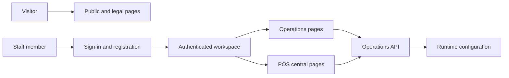

## Overview

The web application is an Angular standalone application rendered on the server and in the browser. Public pages and authenticated workspace routes live in one application; route guards protect the workspace and role-aware navigation determines which operational areas are exposed.

## Component Flow

At startup, the browser reads `runtime-config.js`, which provides the API base URL without rebuilding the web image. HTTP services in `core/` call the API; pages in `pages/` subscribe to those services and render the resulting operational state.

## Routing

- Public routes include the home page, privacy notice, terms of service, and quality/hygiene page.
- Authentication routes provide sign-in and registration.
- The `/app` route is guarded and contains the staff workspace.
- POS routes are additionally controlled by role: managers and administrators can access POS operations, while catalog and incident administration are restricted to administrators.

## Boundaries

The web app owns presentation, navigation, and user interaction. It does not own the shared business records or authorization rules: it sends authenticated requests to the API, which enforces those rules and returns the operational data.
