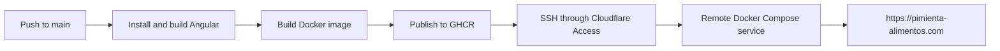

## Runtime

The application is built and served as an Angular SSR application with a Node.js and Express runtime. The production container listens on port 4000 and requires `API_BASE_URL` plus `ALLOWED_HOSTS` at runtime.

## Delivery Flow



Pull requests and pushes to `main` that change `web/` run the production build. A successful push to `main` publishes `latest` and commit-tagged images to GHCR, then the remote server pulls and recreates only the web service through Cloudflare Access.

## Local Development

```sh
cd web
npm ci
npm start
```

`npm run build` performs a production build and `npm test` runs the configured test command.
