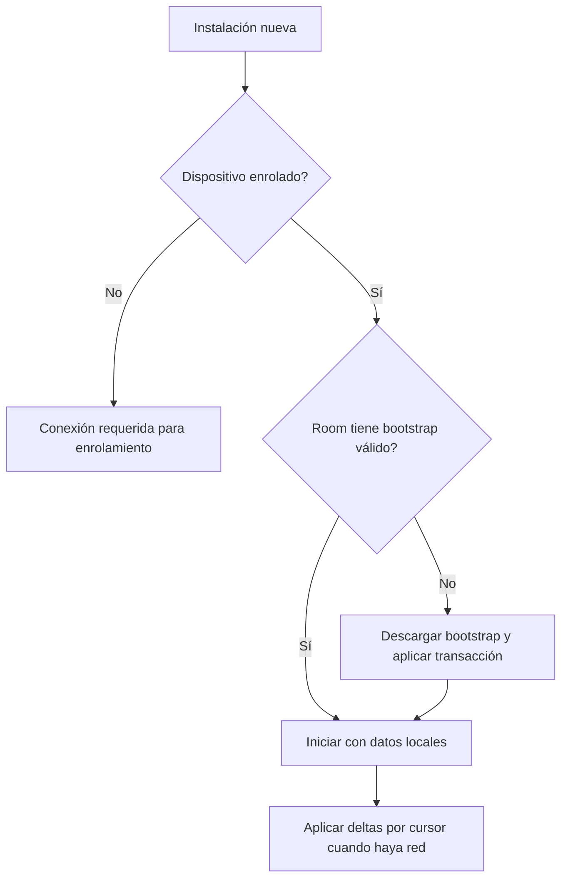

# Datos reales e integración

## Principio

La experiencia de desarrollo no debe depender de tarjetas inventadas, nombres falsos ni respuestas simuladas como demostración principal. La aplicación debe mostrar catálogo y reglas parecidas a la operación real desde la primera fase local.

Esto no elimina los dobles de prueba: una prueba unitaria puede usar un repositorio falso controlado. La diferencia es que la aplicación demostrable y sus fixtures usan datos sanitizados derivados de la fuente real.

## Dos fuentes de datos por entorno

### Desarrollo local sin backend disponible

Un snapshot `pos-bootstrap` sanitizado contiene:

- sede de desarrollo;
- tablets/usuarios de prueba no productivos;
- productos, categorías, precios y banderas de inventario;
- disponibilidad por sede;
- configuración de stock y monto abierto;
- saldos iniciales representativos.

El snapshot usa los mismos identificadores y forma de datos que el bootstrap remoto siempre que sea posible. Se empaqueta solo en la variante `debug`, nunca como seed automático de producción.

### Operación o integración real

Una tablet enrolada obtiene el bootstrap desde el backend y aplica el snapshot en Room. La aplicación de producción no inventa usuarios, productos ni existencias si no recibió datos válidos.

## Proceso de seed recomendado

```text
Modelo/datos existentes del backend
            ↓ exportación sanitizada y revisable
pos-bootstrap.json para debug
            ↓ importador Room de debug
Base local de emulador/tablet de desarrollo
```

El exportador debe ser una herramienta de desarrollo, no una pantalla del POS. Puede vivir en el backend o en un script del repositorio una vez que se inspeccione el modelo existente. Debe preservar valores que importan para UX: códigos, nombres, precios, categorías, disponibilidad y productos preparados.

## Descubrimiento obligatorio antes de integrar cloud

Antes de escribir cliente HTTP, se revisan el backend y base de datos existentes para responder estas preguntas:

1. ¿Cuál entidad representa realmente la sede: `Headquarter`, `Project`, `Sucursal` u otra?
2. ¿Cómo se representan actualmente producto, precio, costo, stock, categoría y disponibilidad?
3. ¿Qué identificadores pueden conservarse en Android y cuáles necesitan mapeo?
4. ¿Existen ya endpoints de catálogo, autenticación, usuarios o inventario reutilizables?
5. ¿Cuál es el esquema de autenticación actual y cómo convivirá con credenciales de dispositivo?
6. ¿Hay movimientos de inventario históricos o solo un saldo mutable?
7. ¿Cuál ambiente local/desarrollo permite probar sin tocar datos productivos?

El resultado debe registrarse como un documento de mapeo, por ejemplo `docs/implementation/backend-pos-mapping.md`, antes de fijar DTOs, rutas o migraciones del backend.

## Bootstrap y migración local



Una migración de esquema Room debe conservar ventas, turnos, outbox, auditoría e impresión pendientes. Los datos maestros se pueden reemplazar por versión/cursor; los hechos operativos no se eliminan ni se regeneran.

## Datos de prueba necesarios

El snapshot debug debe cubrir intencionalmente estos casos:

- productos por pieza con stock normal, bajo, cero y negativo;
- alimentos preparados sin inventario controlado;
- producto no disponible centralmente;
- productos por unidad con códigos internos y comerciales;
- categorías de monto abierto;
- cajero, Manager y Superadmin de prueba;
- turno abierto y datos suficientes para probar Corte Z;
- al menos una venta en efectivo, tarjeta externa, cancelada, con impresión pendiente y pendiente de sincronización.

No se usan nombres, teléfonos, tarjetas, PINs reales ni datos privados de clientes. Los usuarios/credenciales de prueba son exclusivos del entorno de desarrollo.

## Sin mocks en demostración, fakes en pruebas

- **Demostración local:** Room con snapshot sanitizado realista.
- **Prueba de integración:** Room + backend de desarrollo o instancia local de Spring Boot.
- **Prueba unitaria:** fakes deterministas para repositorios, reloj, impresora o cliente HTTP cuando aíslen una regla.
- **Prueba manual de hardware:** tablet, hub, lector e impresora reales.

Los fakes no sustituyen el flujo de demostración ni el contrato de backend; permiten probar fallos que sería costoso reproducir manualmente.
