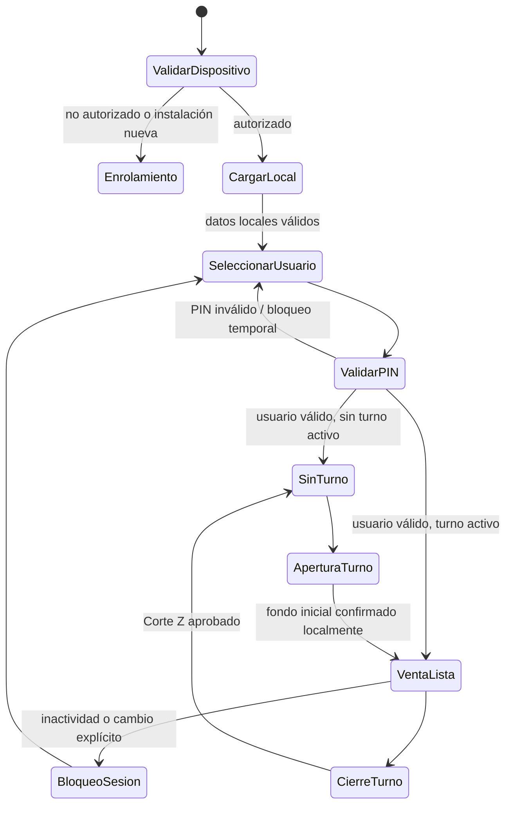
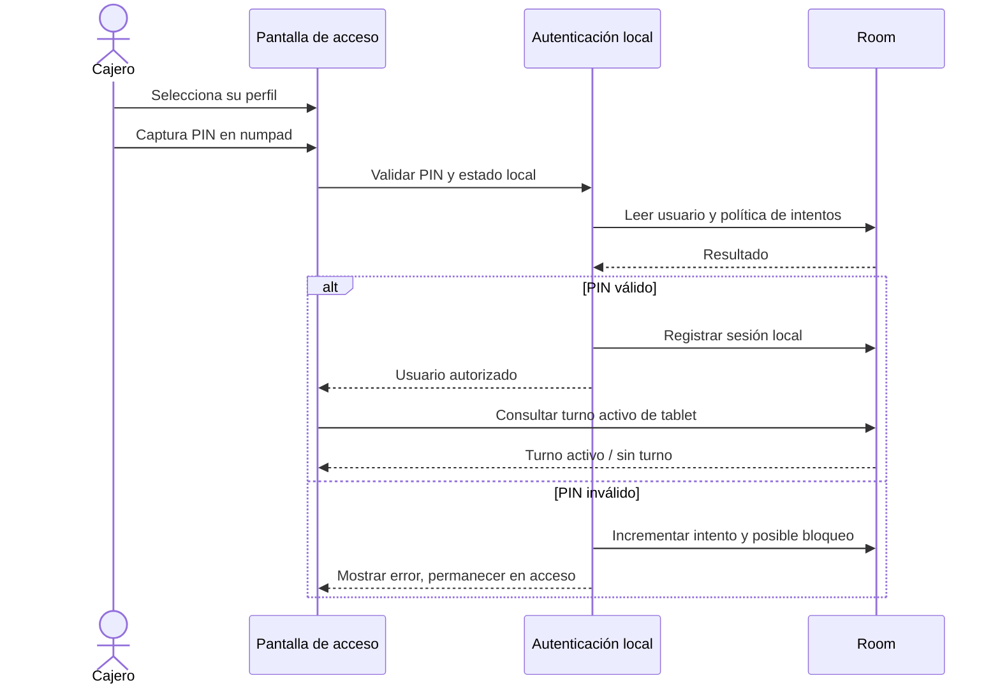
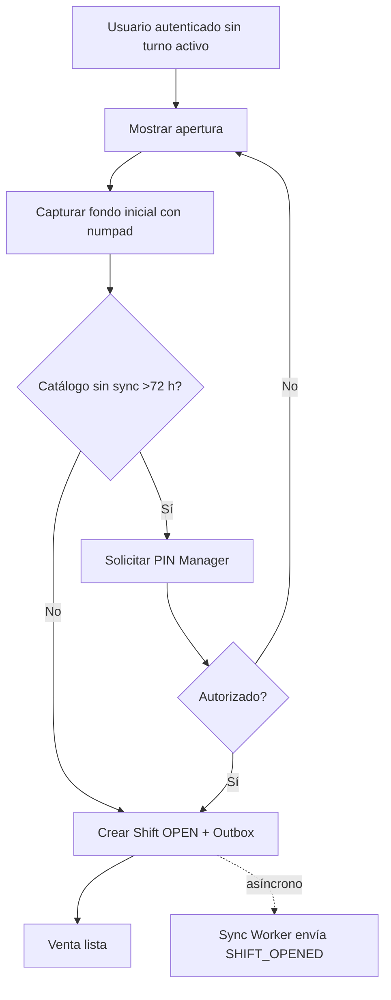

# Ciclo operativo: aplicación, sesión y turno

## Objetivo

Definir cómo una tablet llega de estar bloqueada o sin turno a una venta lista para cobrar. La pantalla de venta no debe estar disponible para cobrar si no existe un dispositivo autorizado, datos locales mínimos y un turno activo.

## Estados de aplicación



## Datos mínimos para vender

La tablet necesita conservar localmente:

- identidad y autorización de dispositivo;
- sede asignada;
- usuarios autorizados y verificadores de PIN;
- configuración de operación;
- catálogo efectivo de la sede;
- turno activo de la tablet.

Si la tablet ya fue enrolada y tiene esos datos, puede llegar a Venta Lista sin red. Una instalación nueva no puede iniciar operación sin completar enrolamiento y bootstrap mientras existe conexión.

## Flujo de inicio de sesión



### Guardias

- PIN no se transmite para validar una sesión cotidiana.
- La pantalla aplica límite de intentos y bloqueo temporal.
- El usuario deshabilitado centralmente se bloquea al siguiente sincronizado.
- Un cajero no puede cambiar de usuario con un carrito no vacío sin resolverlo primero.

La última guardia es una propuesta de UX que evita atribuir una venta en curso a otra persona; requiere confirmación antes de implementarse.

## Apertura de turno



La apertura se confirma localmente y no espera backend. Si el catálogo tiene más de 72 horas sin actualización, la aprobación de Manager queda vinculada al turno nuevo.

## Sesión, acceso a Admin y retorno

El acceso al panel local de Manager es una elevación temporal de permiso. El PIN autorizador no reemplaza la identidad del cajero del turno.

```text
Venta con cajero activo
      ↓ [Admin]
PIN Manager/Superadmin
      ↓
Panel local de Manager
      ↓ [Volver a caja]
Misma sesión de cajero y mismo carrito, si existía
```

## Criterios de aceptación

1. Una tablet enrolada puede iniciar sesión y abrir turno sin red.
2. No puede existir más de un turno activo por tablet.
3. La aplicación no permite cobrar sin turno activo.
4. Un PIN inválido no permite avanzar y queda sujeto a límite de intentos.
5. Un Manager que entra al panel no se convierte en cajero de ventas previas ni futuras.
6. Si falla sincronización de apertura, el turno continúa abierto localmente y el evento queda en outbox.
