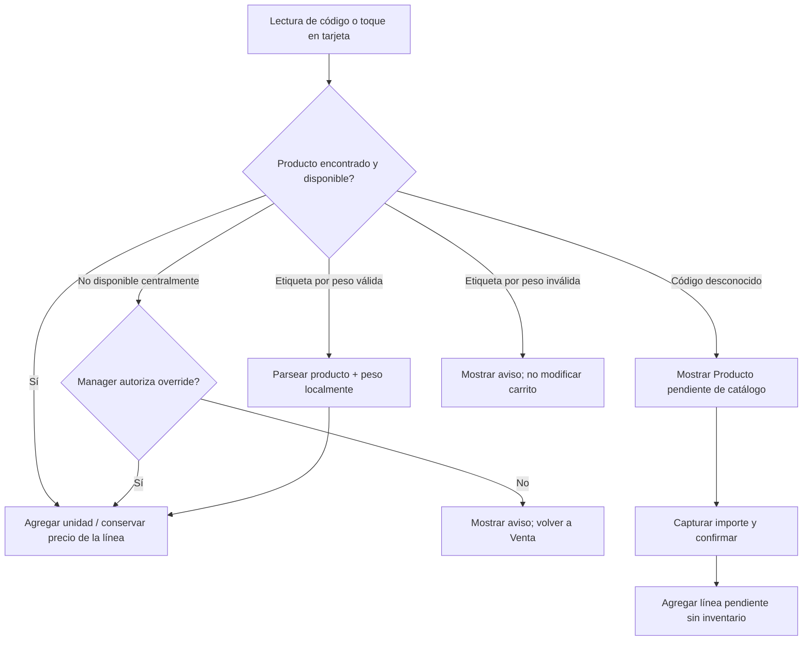
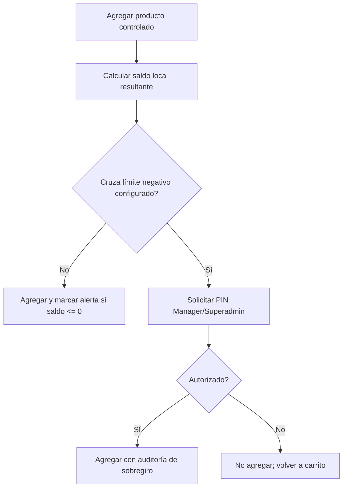
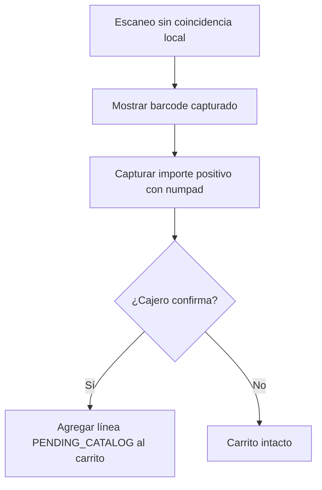
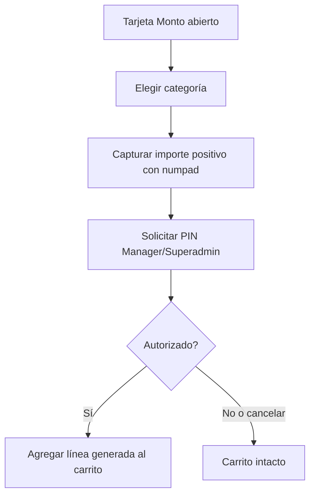

# Venta y pagos

## Objetivo

Completar una venta sin depender de red, manteniendo evidencia contable, inventario, impresión y sincronización consistentes. La pantalla principal permanece fija; el panel derecho alterna entre carrito y cobro.

## Happy path de venta en efectivo

```mermaid
sequenceDiagram
    actor Cajero
    participant UI as Venta
    participant DB as Room
    participant Print as Cola de impresión
    participant Outbox as Outbox
    participant Sync as Sync Worker
    participant API as Backend

    Cajero->>UI: Escanea o toca un producto
    UI->>DB: Leer catálogo local y agregar/incrementar línea
    DB-->>UI: Carrito actualizado con precio snapshot
    Cajero->>UI: Toca Cobrar
    UI-->>Cajero: Panel de efectivo y numpad
    Cajero->>UI: Captura efectivo recibido
    UI-->>Cajero: Muestra cambio
    Cajero->>UI: Confirma cobro
    UI->>DB: Transacción local de venta confirmada
    DB->>Outbox: Crear SALE_CONFIRMED
    DB->>Print: Crear PrintJob PENDING
    DB-->>UI: Venta confirmada; regresar a carrito vacío
    Print-->>UI: Estado de impresión si requiere atención
    Outbox->>Sync: Activar envío cuando sea posible
    Sync->>API: Enviar evento idempotente
```

## Transacción local de confirmación

Antes de mostrar éxito al cajero, una única transacción Room crea o actualiza:

1. venta con UUID y folio visible definitivo;
2. líneas con nombre, categoría, cantidad y precio snapshot;
3. descuento autorizado, si existe;
4. componentes de pago;
5. movimientos de inventario de productos controlados;
6. auditorías y autorizaciones asociadas;
7. evento `SALE_CONFIRMED` en Outbox;
8. trabajo de impresión pendiente.

Si la transacción local no termina, la venta no está confirmada y la interfaz conserva el carrito para corrección o reintento. Si termina, red e impresión nunca revierten el cobro.

## Agregar artículos



### Reglas de interfaz

- Cada toque agrega una unidad y da feedback visual/háptico.
- Incrementar cantidad conserva el precio de la línea existente.
- Un producto marcado no disponible después de agregarse puede cobrarse, pero no aumentar cantidad sin override.
- Código desconocido no inicia monto abierto manual. Abre la superficie de producto pendiente con el barcode capturado; el cajero debe capturar importe y confirmar explícitamente antes de agregar la línea.
- La línea pendiente no tiene `productId`, no descuenta inventario y se reporta como `Pendiente de catálogo`. El barcode es su evidencia y se conserva en el ticket y la venta.
- Durante un borrador de cobro no confirmado, una lectura válida o toque de producto cancela ese borrador, agrega el artículo y devuelve el panel derecho al carrito. La interfaz avisa que el total fue actualizado; no hay venta ni pago persistido.
- Solo durante la confirmación atómica, después de pulsar **Confirmar cobro e imprimir**, se bloquean lector, catálogo y cambios de carrito hasta recibir el resultado local.

## Guardias de inventario



## Producto pendiente de catálogo

El flujo completo está en [Producto pendiente de catálogo](../ux/04-producto-pendiente-catalogo.md). Se resume así:



No requiere PIN de Manager, categoría manual ni texto libre. Superadmin crea posteriormente el producto maestro en la Web Central; las líneas ya cobradas permanecen pendientes y no se vinculan ni afectan inventario retrospectivamente.

## Pagos

### Efectivo

El panel de cobro usa numpad y denominaciones rápidas. El efectivo recibido debe ser igual o mayor al total; el cambio se calcula antes de confirmar. La confirmación registra monto recibido y cambio entregado para el efectivo esperado del turno.

Si falta un artículo antes de confirmar, el cajero puede tocarlo o escanearlo directamente desde el catálogo visible. El POS vuelve al carrito, conserva el método e importe recibido solo como borrador de interfaz y recalcula el total; nada se registra hasta la confirmación final.

### Tarjeta externa

```text
Carrito visible; cobro aún no confirmado
      ↓
Cajera cobra el importe en terminal externa de Mercado Pago
      ↓
¿Terminal aprobó?
      ├── No: cancelar intento o agregar faltante → mismo carrito editable
      └── Sí: cajera confirma inmediatamente en POS → venta local confirmada
```

El POS no solicita ni valida datos de tarjeta, ni consulta Mercado Pago. Puede capturar una referencia opcional si la terminal la muestra sin añadir fricción. Como el POS no conoce el estado real de la terminal, una vez que esta aprueba el cargo el cajero no debe volver a agregar artículos: confirma el ticket de inmediato.

### Pago mixto reservado

El tipo `MIXTO` permanece reservado para una posible ampliación, pero no se muestra ni puede confirmarse en el POS hasta validar el requisito con el cliente. El modelo conserva la capacidad futura de asociar varios componentes a una venta, sin definir todavía interacción ni reglas de operación.

## Monto abierto

El flujo completo está en [Monto abierto](../ux/02-monto-abierto.md). Se resume así:



La línea se llama `Producto abierto · {categoría}`, no modifica inventario y queda marcada para revisión posterior.

## Descuento

Un cajero solicita un descuento sobre el total de la venta antes de confirmarla. La interfaz conserva el carrito y abre una superficie temporal de autorización: importe fijo positivo en pesos, motivo obligatorio y PIN de Manager/Superadmin. Si se autoriza, muestra importe, motivo y nuevo total. Solo existe un descuento por venta MVP; no se aceptan porcentajes ni descuentos por línea.

Si el importe autorizado cubre el total, la operación se clasifica como `CORTESIA`: no recibe efectivo ni tarjeta, se confirma como venta de cortesía y conserva sus movimientos de inventario. Si es parcial, el total neto restante sigue el flujo normal de efectivo o tarjeta externa.

Después de **Confirmar cobro e imprimir**, ni el precio capturado ni el descuento pueden modificarse. Una corrección posterior no es un descuento adicional: solo puede ser la cancelación total autorizada cuando la política de postventa la permita.

## Retornos seguros

- **Cancelar intento de pago:** vuelve al mismo carrito editable; no existe venta ni pago confirmados.
- **PIN rechazado:** conserva la acción pendiente; no modifica datos.
- **Impresora falla tras cobro:** vuelve a carrito nuevo con alerta pendiente; la venta está confirmada y el `PrintJob` falla o espera reintento.
- **Red falla tras cobro:** vuelve a carrito nuevo con indicador de cola; la venta está confirmada y el Outbox queda pendiente.
- **Error al guardar localmente:** conserva el mismo carrito; no existe venta confirmada.

## Criterios de aceptación

1. Una venta en efectivo completa se confirma con la red desconectada.
2. Una venta confirmada genera folio, evento de sincronización y trabajo de impresión en la misma transacción local.
3. Cancelar tarjeta declinada no pierde artículos del carrito.
4. Una impresión fallida no permite confirmar la misma venta otra vez ni revierte dinero.
5. Monto abierto requiere categoría, importe y autorización, sin teclado alfanumérico.
6. Un scanner desconocido solo agrega una línea pendiente después de que el cajero capture importe y confirme explícitamente.
7. Un producto válido leído o tocado durante un borrador de cobro vuelve automáticamente al carrito, lo agrega y recalcula el total sin crear un pago.
8. Tras iniciar la confirmación atómica, el POS no acepta lecturas ni cambios hasta concluir el registro local.
9. Crear posteriormente un producto maestro con un barcode pendiente afecta únicamente ventas futuras; las líneas históricas no reciben producto ni inventario retrospectivo.
10. Un descuento requiere importe fijo en pesos, motivo y PIN; una venta de cortesía no registra efectivo ni tarjeta, pero sí conserva inventario y auditoría.
