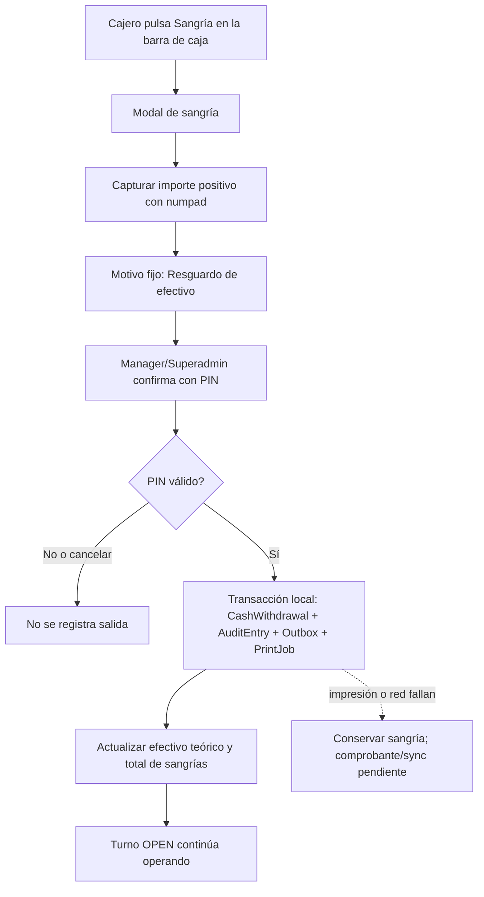
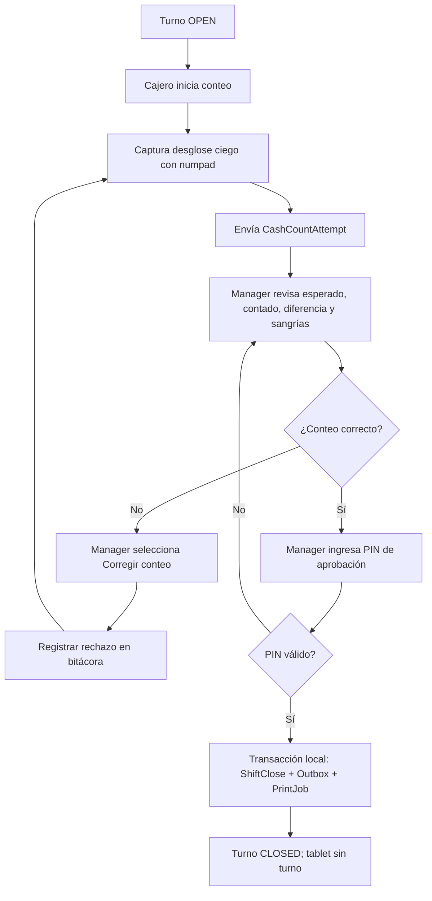
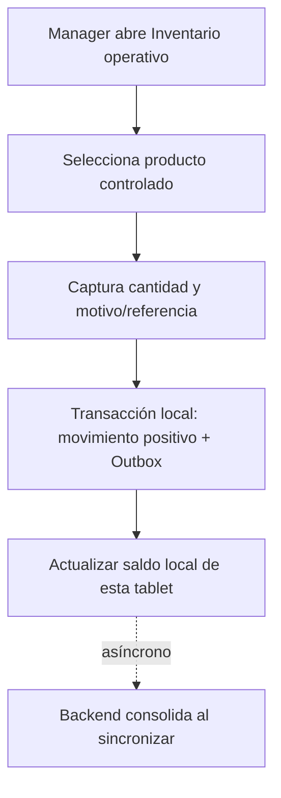
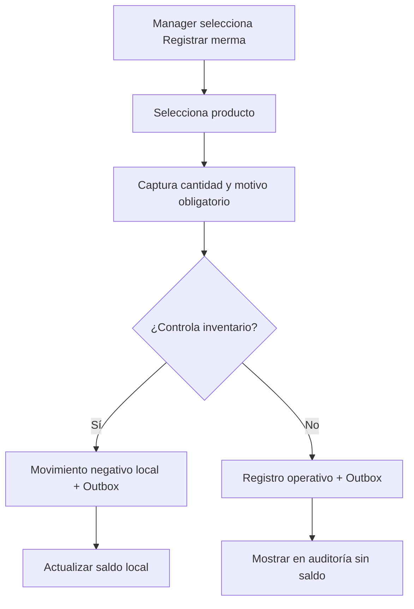
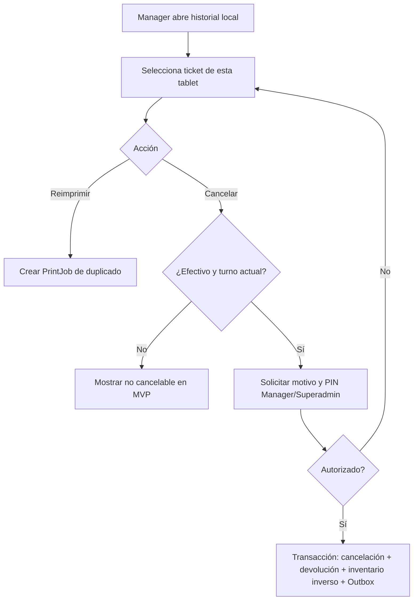

# Manager, turno e inventario operativo

## Objetivo

Definir las acciones operativas de Manager que ocurren en la tablet: autorización/consulta de sangrías de resguardo, cierre de turno, reposición, merma, historial, reimpresión y cancelación permitida. Las acciones centrales siguen perteneciendo a la web administrativa.

## Sangría de resguardo durante el turno

Una sangría es una salida física de efectivo para resguardar el cajón mientras el turno sigue abierto. No es un cierre parcial, no crea otro turno y no representa un gasto o pago a proveedor.



La operación conserva el cajero titular del turno y el autorizador. El panel de Manager no crea sangrías: solo muestra la lista del turno, cada registro y su estado de impresión/sincronización; el total se calcula al sumar dichos registros.

El efectivo esperado al final del turno se deriva de:

```text
fondo inicial + efectivo neto cobrado - devoluciones de efectivo - sangrías confirmadas
```

Una sangría ya confirmada no se edita ni se borra. El procedimiento excepcional para corregirla queda pendiente de definición; no se disfraza como gasto ni como ingreso adicional.

## Corte Z con doble control



### Separación de responsabilidades

- **Cajero:** captura el conteo físico sin ver efectivo esperado ni diferencia.
- **Manager/Superadmin:** ve el resumen posterior, puede rechazar y aprueba con PIN.
- **Sistema:** calcula efectivo esperado, diferencia y resumen de turno solo tras recibir el conteo.

Al cerrar, la tablet permite iniciar un turno nuevo aunque eventos anteriores sigan en cola. Cada intento de conteo, rechazo y aprobación conserva cajero, autorizador y fecha.

## Reposición operativa



No requiere proveedor, factura, compra ni actualización manual del inventario maestro. Es una entrada operativa auditable.

## Merma



El cierre muestra las mermas; no vuelve a crearlas.

## Historial, reimpresión y cancelación



La cancelación postventa nunca elimina el ticket ni sus pagos originales. Solo se permite a ventas totalmente en efectivo, dentro del turno activo. Tarjeta externa muestra el estado no cancelable en MVP.

## Administración que no vive en tablet

Los siguientes flujos no se diseñan en el panel local porque requieren visión central, teclado amplio o permisos de Superadmin:

- creación/edición de productos, precios, categorías y disponibilidad persistente;
- conteo físico maestro, ajuste masivo y compras a proveedores;
- usuarios, roles, PINs, licencias y dispositivos;
- clientes, fiados, apartados y cuentas por cobrar;
- CSV, reportes globales, ganancia consolidada e inventario valorizado;
- resolución central de incidencias y creación de productos maestros a partir de barcodes pendientes.

## Criterios de aceptación

1. El cajero no puede ver efectivo esperado antes de enviar su conteo.
2. Manager puede devolver un conteo a corrección y cada intento se conserva.
3. El Corte Z aprobado cierra el turno local aunque no haya internet.
4. Reposición y merma modifican solo el saldo local de la tablet hasta sincronizar.
5. Reimprimir no genera venta, pago ni movimiento de inventario.
6. Cancelar una venta en efectivo genera reversión auditable, no borrado.
7. Una sangría no cierra el turno, se conserva como registro inmutable y se incorpora al efectivo esperado del Corte Z.
