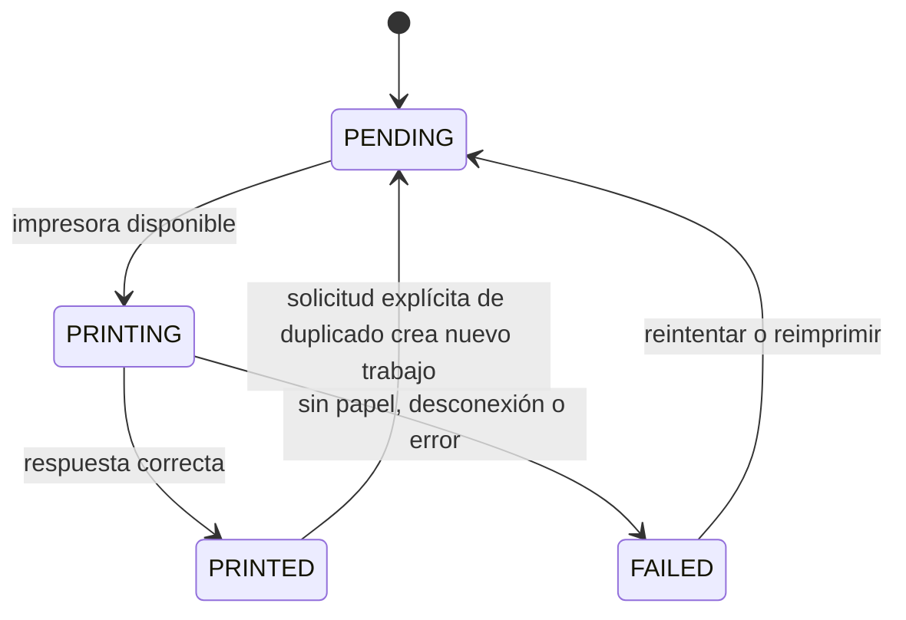
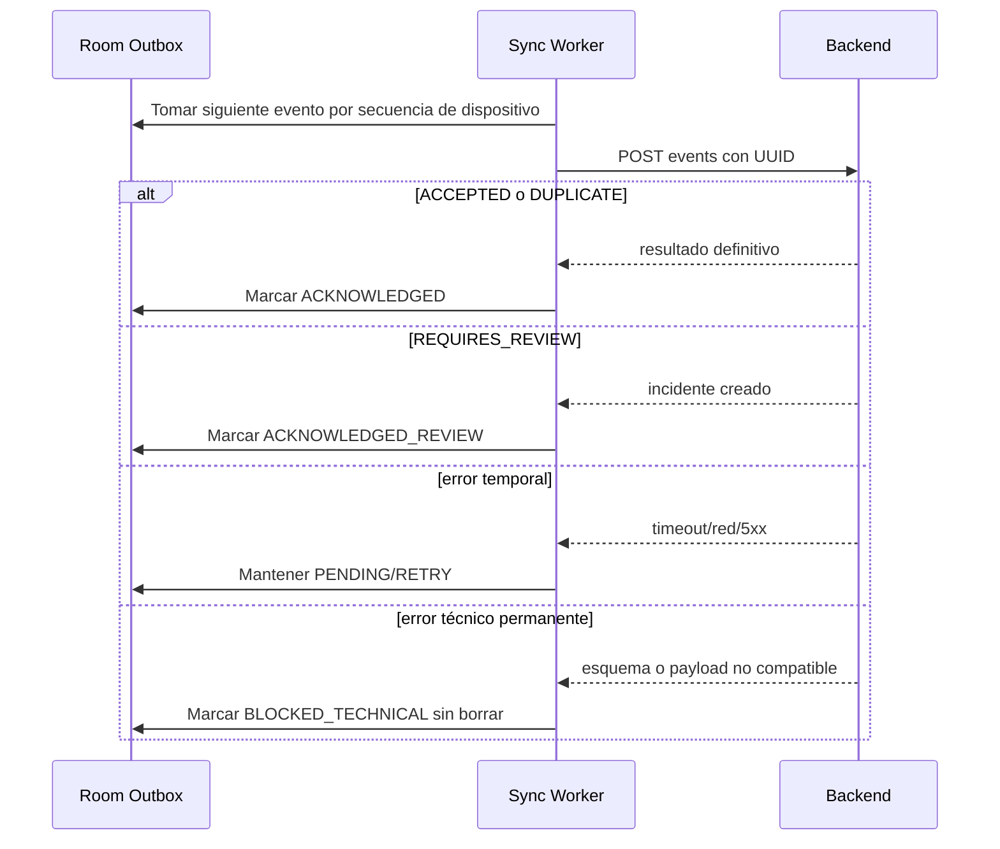
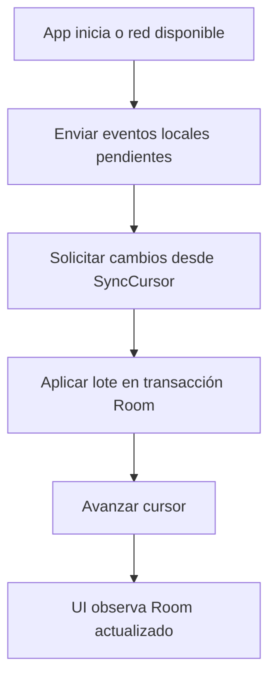
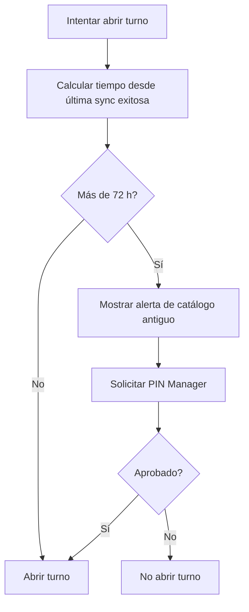

# Procesos asíncronos y recuperación

## Objetivo

Definir procesos que ocurren fuera del gesto principal del usuario. Deben ser visibles cuando requieren atención, pero no bloquear una venta ya confirmada.

## Clasificación de efectos

```text
Confirmación local
      ├── PrintJob: intenta imprimir ticket
      ├── Outbox: intenta sincronizar hechos
      ├── Pull sync: descarga cambios maestros
      └── Diagnóstico: actualiza estado de periféricos/red
```

## Impresión

La tablet imprime desde datos estructurados, no desde archivos. Después del commit local, un `PrintJob` obtiene el documento, aplica la plantilla vigente de 58 mm y genera comandos ESC/POS en memoria. El adaptador los envía por USB o TCP/IP. La conversión debe respetar caracteres españoles mediante la code page soportada por la impresora; la selección exacta de esa code page es una validación de hardware pendiente.



### Regla de experiencia

Después de confirmar cobro, la UI vuelve al carrito vacío. Si impresión falla, muestra un indicador persistente y accesible desde historial/estado. Nunca ofrece “deshacer venta” por un fallo de papel.

## Sincronización de salida



Un solo worker drena la cola por tablet. La cola está en Room; WorkManager solo despierta o reanuda el procesamiento. Una petición manual de “intentar sincronizar ahora” activa el mismo flujo, no un mecanismo paralelo.

## Sincronización de entrada



Los datos maestros descargados incluyen catálogo efectivo, disponibilidad, inventario central conocido, usuarios, configuración y estado de dispositivo. Una actualización remota no altera líneas de ventas confirmadas ni un carrito con precios snapshot.

## Catálogo desactualizado



La advertencia no interrumpe un turno o venta ya activos.

## Errores visibles y retorno seguro

- **Sin red:** indicador de modo offline y número de eventos pendientes; venta continúa.
- **Cola con reintentos:** indicador no bloqueante y acceso a Estado para diagnóstico.
- **Evento bloqueado técnicamente:** alerta administrativa visible; conserva evidencia y no reintenta sin compatibilidad corregida.
- **Venta requiere revisión:** no modifica la caja local; se consulta como estado de sync, se resuelve solo en web central por Superadmin.
- **Dispositivo revocado al reconectar:** se detiene la sincronización y se bloquea/cierra sesión; mientras permanezca offline no puede conocer la revocación.
- **Producto/catálogo vacío por instalación incompleta:** no se permite venta hasta bootstrap válido.

## Criterios de aceptación

1. Reiniciar la app no pierde ventas, eventos ni trabajos de impresión pendientes.
2. Reintentar la misma venta no crea duplicados centrales.
3. Un evento de venta con incidencia de negocio queda recibido y marcado para revisión, no descartado.
4. El cursor no avanza si falla al aplicar un lote de cambios remotos.
5. La UI puede atender ventas mientras existe una cola de sincronización pendiente.
