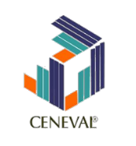
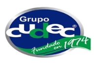
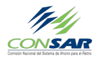

# Pimienta Alimentos

> UN TOQUE DE PLACER A TUS SENTIDOS

## MISIÓN

Desarrollar nuestros productos y servicios de manera contínua para satisfacer las necesidades de alimentación de nuestros clientes en higiene, presentación, sabor, valor alimenticio, cantidad y atención, con el fin de desarrollar un próspero negocio tanto con nuestros clientes como con nuestros proveedores.

## OBJETIVOS

Contribuir con los objetivos estratégicos de nuestros clientes y consumidores satisfaciendo las necesidades alimenticias de su personal en todos los niveles

## NUESTRO COMPROMISO

Generar en nuestros clientes la mayor satisfacción a través de un servicio personalizado y de la más alta calidad en alimentos,siempre brindando un trato de calidez.

- CALIDAD DE MATERIA PRIMA
- PERSONAL ALTAMENTE CALIFICADO
- BUENA IMAGEN DEL PERSONAL
- EXCELENTE ATENCIÓN PERSONAL
- MAGNÍFICA PRESENTACIÓN DE LOS PLATILLOS
- HIGIENE Y PULCRITUD

**Attendiendo Profesionalmente desde 2010**

## NUESTRA EMPRESA

> ## La satisfacción más grande es servir....

Surgimos en el año 2010 con la misión de brindar al mercado una propuesta de servicio de alimentos institucionales con el más alto sentido de calidez humana.

Somos una empresa Mexicana comprometida con la calidad en el servicio de alimentos, especializada en la administración de cafeterías y comedores institucionales.

Nuestra labor se centra en emplear el mejor talento de nuestros colaboradores para brindar a nuestros clientes una experiencia personalizada.

Contamos con personal altamente calificado con más de 20 años de experiencia en la industria de alimentos, y con muchas ganas de sobresalir, lo que en conjunto se traduce en ofrecer una experiencia que supere las expectativas de nuestros clientes

## NUESTRA FILOSOFÍA

> _"Lograr tener clientes satisfechos es una tarea de equipo, trabajo constante, honesto y un compromiso inamovible con la calidad en todo sentido. Tratar a tus colaboradores como a tu familia, a tus proveedores como a tus amigos y a tus clientes como los invitados de honor definitivamente es una fórmula para el éxito en cualquier empresa."_

_Marcos F. Pérez Zúñiga Director General_

## NUESTROS SERVCIOS

Atendemos miles de comensales diariamente, asegurándonos que cada detalle y cada platillo este elaborado con los mejores ingredientes, la mayor higiene y la mejor sazón.

Contamos con personal altamente calificado con más de 20 años de experiencia en la industria de alimentos, logrando así superar las expectativas de nuestros clientes y comensales.

Nuestra infraestructura empresarial nos permite atender a cualquier cliente dentro de la República Mexicana, siempre brindando un soporte y atención personalizada las 24 horas los 365 días del año.

Contamos con atención a:

- Cafeterías escolares
- Hospitales
- Comedores empresariales
- Instituciones
- Aeropuertos y terminales de autobuses

## HIGIENE Y SEGURIDAD

Incluimos semestralmente a nuestro personal a un Programa de Análisis Clínicos, aplicables a los colaboradores que manipulan alimentos.

- Coproparasitoscópico.
- Exudado Faríngeo.
- Frotis de mano.
- Reacciones Febriles, primordialmente.

Llevamos a cabo el Programa de Análisis Micro biológico a los alimentos y superficies inertes, con la frecuencia de cada cuatro meses en laboratorios acreditados ante la EMA. Supervisamos que nuestro personal cumpla con las normas de seguridad e higiene. . Además garantizamos que en un plazo de 4 a 6 meses se obtendrá el distintivo “H” dependiendo de las instalaciones y con apoyo del cliente. Se cuenta con manual operativo de todos los procesos para garantizar la calidad y con Consultor de Distintivo “H” interno.

## OFRECEMOS

- Confianza.
- Capacitación.
- Seguridad en el servicio.
- Experiencia de nuestro personal de más de 10 años.
- Apoyo las 24 horas los 365 días del año.
- Capacidad de respuesta rápida a las necesidades del cliente.
- Conocimiento de la industria.
- Capacidad financiera.
- Infraestructura e innovación de vanguardia en el mercado de la alimentación.
- Conocimiento y aplicación de las normas de higiene

## Nuestros Clientes

## Contacto

Teléfono: (+52) 55 3639 1856
Correo electrónico: perezmarcos25@hotmail.com
Dirección: Ahuejote 288, Colonia Pedregal De Santo Domingo, Cuidad de México, C.P. 04369
